[<к содержанию](./readme.md)

# **Создание проекта с нуля** 

При помощи команды cd нужно найти нужную папку.

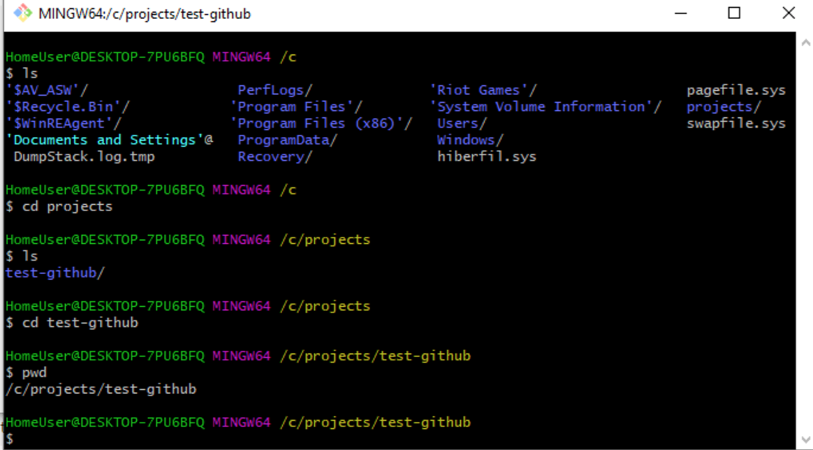

Команда echo "# test-github" >> README.md добавляет новый файл в проект. Его также можно создать вручную в папке.

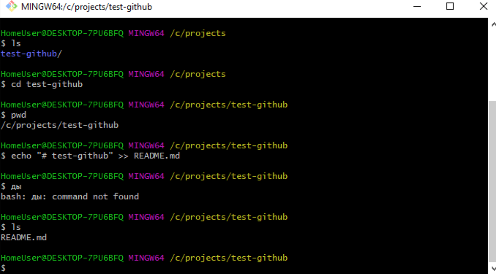

git init — инициализирует проект. После инициализации создаётся специальная скрытая папка для Git:

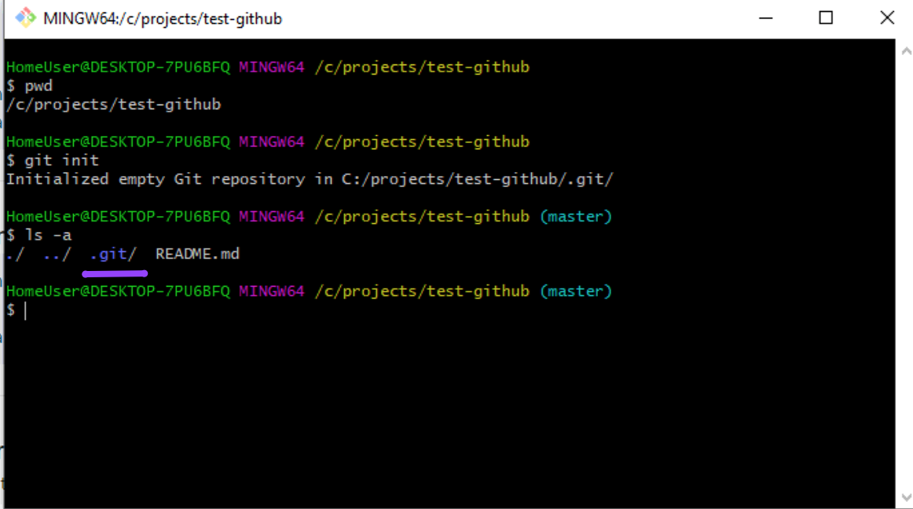

В ней файлы и папки генерируются автоматически. Они нужны для корректной работы Git, никакого дополнительного взаимодействия с этой папкой не предусмотрено

git add README.md — добавляет изменённые файлы к коммиту. Также это можно сделать при помощи команды git add . — в таком случае вы добавите не конкретные файлы, а все изменённые, если их много:

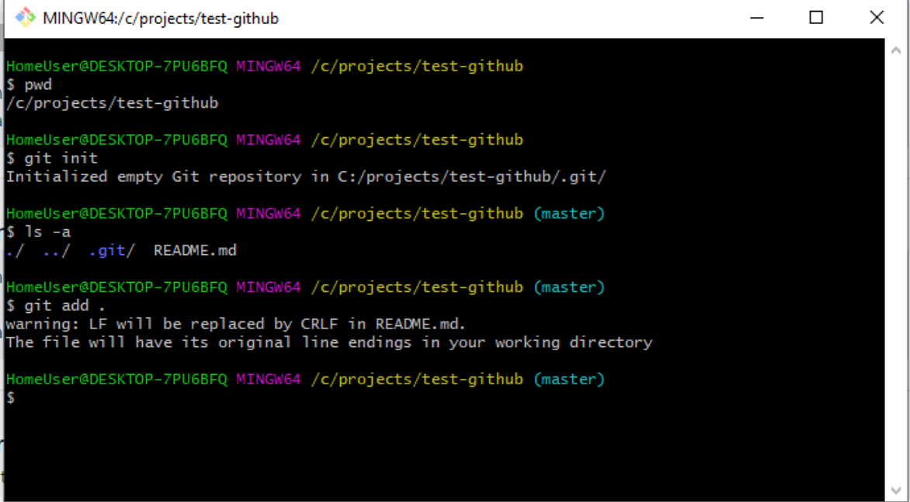

git status поможет проверить, что происходит с изменёнными файлами. В нашем случае, например, файлы не прикреплены к коммиту:

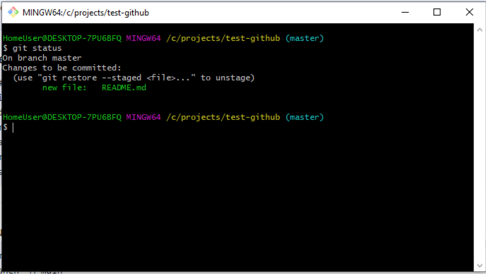

git commit -m "first commit" добавляет сообщение к коммиту — то, что будет отображаться в истории. В скобках можно указать любой текст. Как правило, в нём кратко описывают, что делали в коммите.

Теперь снова посмотрим, что скажет git status. Сейчас он пустой, так как все изменённые файлы мы прикрепили к только что созданному коммиту:

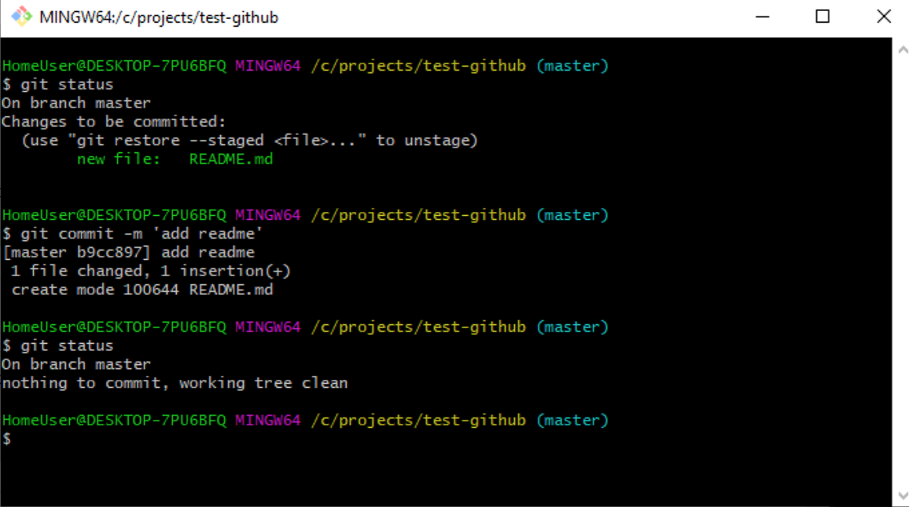

git log показывает историю коммитов:

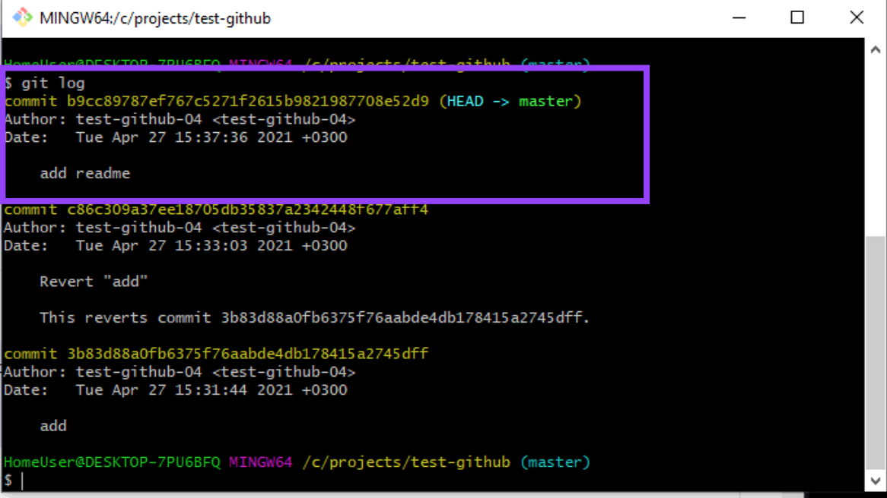

git branch позволяет просмотреть ветки. В нашем примере текущая ветка называется master. Но с 2020 года GitHub выступает за то, чтобы главная ветка называлась main (по политическим причинам) и рекомендует переименовать ветку с помощью команды git branch -M main.

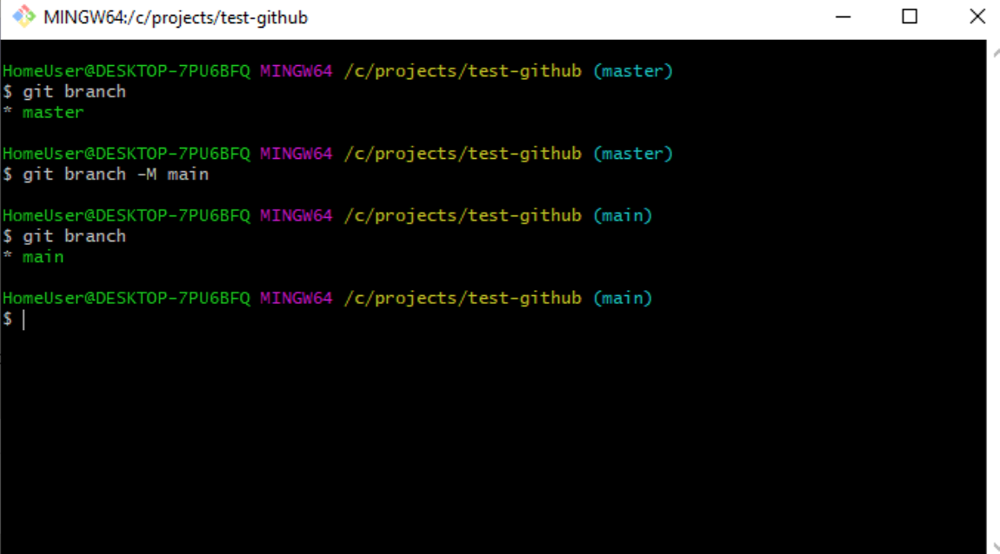

Команда git remote add origin https://github.com/test-github-04/test-github.git добавляет сервер, где origin — это имя сервера, а url — это адрес.

У вас может быть несколько удалённых серверов, с которыми работает проект. Проверить добавленные сервера можно командой git remote -v (fetch — откуда забирать, push — куда отправлять изменения).

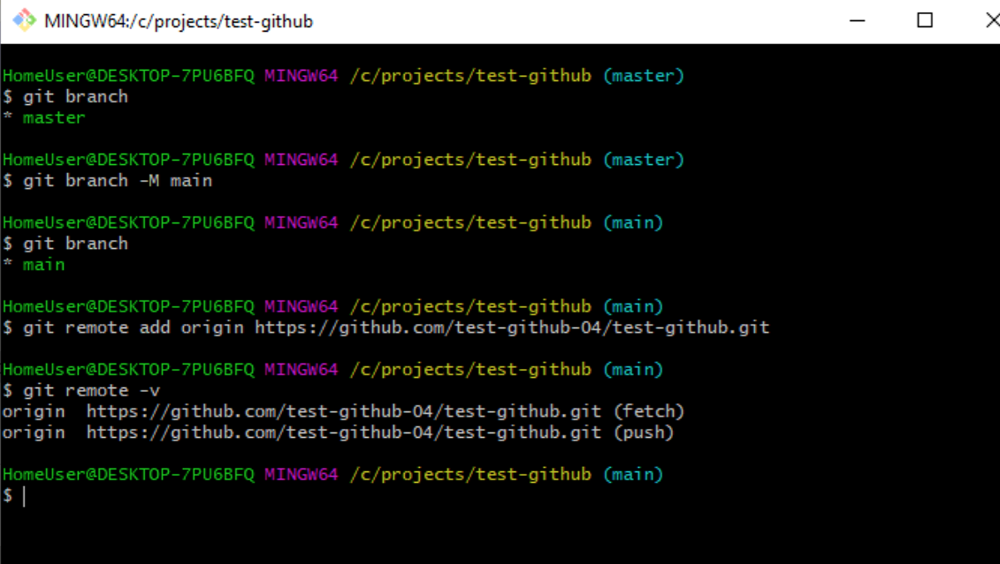

git push -u origin main позволяет запушить (отправить) ветку main на сервер origin. Тут вам, скорее всего, потребуется связать приложение и GitHub, повторно залогинившись через браузер.

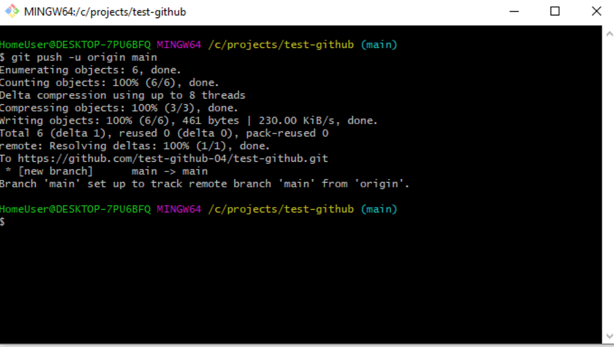

И теперь вас можно поздравить с первым опубликованным [проектом](https://github.com/test-github-04/test-github)!

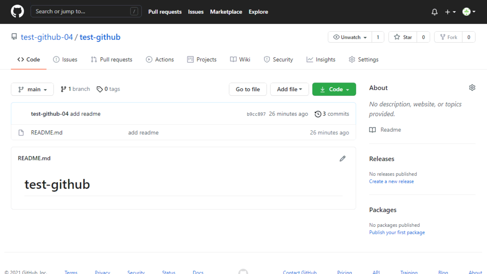

[<к содержанию](./readme.md)