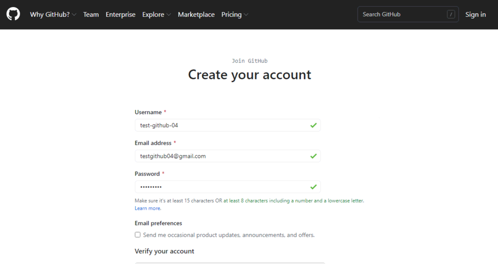
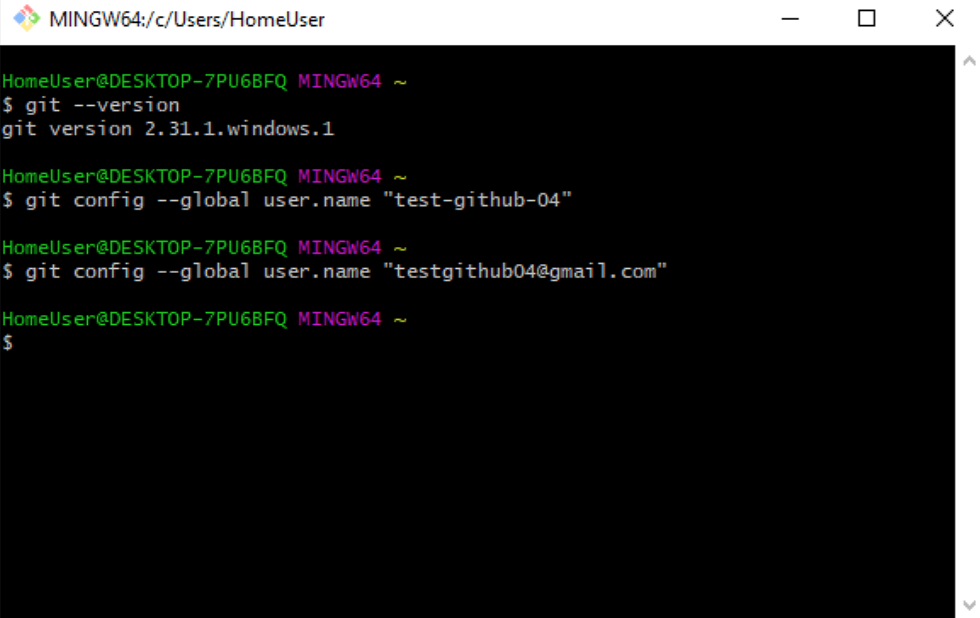
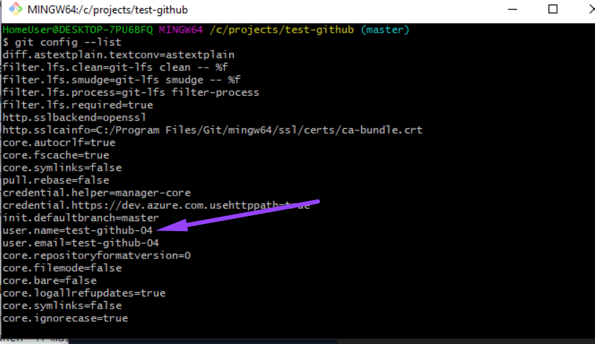

[<к содержанию](./readme.md)

# **Регистрация в GitHub**

Чтобы воспользоваться сервисом, нужно зайти на сайт [GitHub](https://github.com/) и зарегистрировать нового пользователя.

Придумайте имя и пароль, а также введите email, к которому у вас есть доступ:

Теперь, когда у вас есть свой аккаунт, нужно залогиниться в самой консоли, чтобы связать их. Для этого понадобится выполнить команды в консоли, которые зададут имя пользователя и почтовый ящик.

**git config --global user.name "user-name"**

**git config --global user.email email@example.com**

Вместо user-name подставьте логин, который указывали при регистрации. В нашем случае это test-github-04, а вместо email@example.com — адрес вашей электронной почты. В нашем примере — testgithub@gmail.com.

Если вы всё сделали по инструкции, то при выполнении команды **git config --list** отобразится ваше имя пользователя:

Не забудьте верифицировать аккаунт: откройте первое письмо на почте от GitHub и пройдите по ссылке. Иначе вы не сможете создавать репозитории.