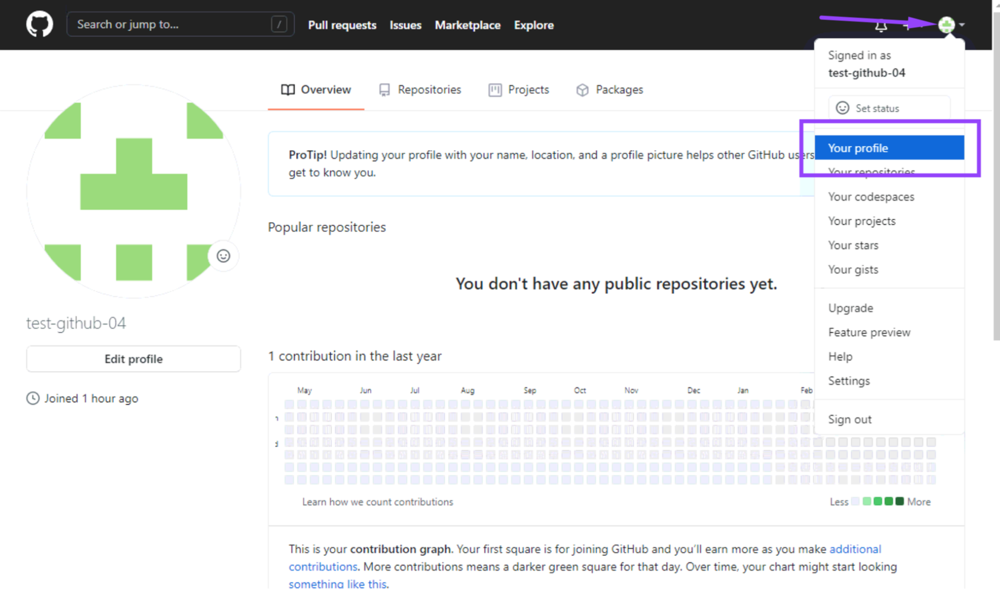
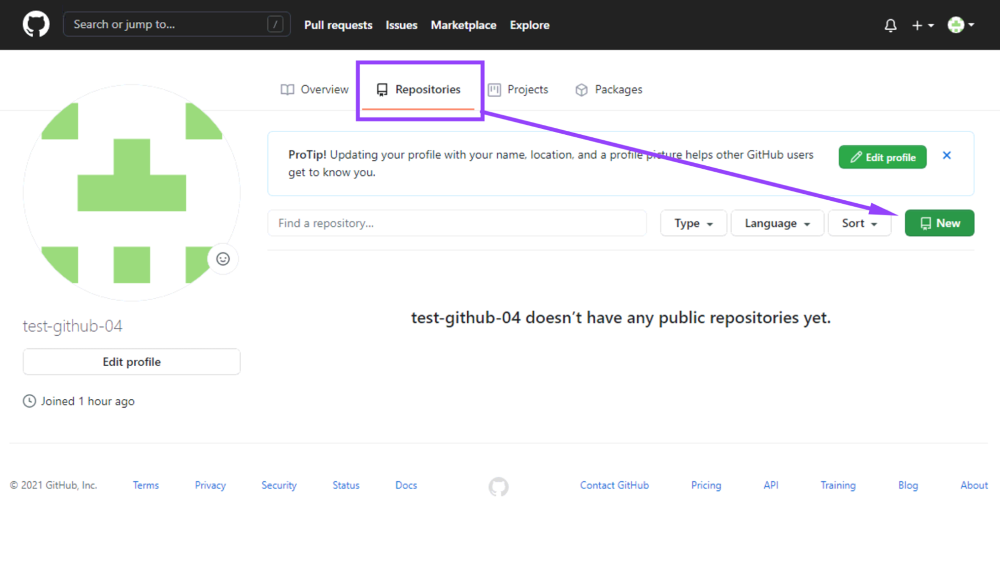
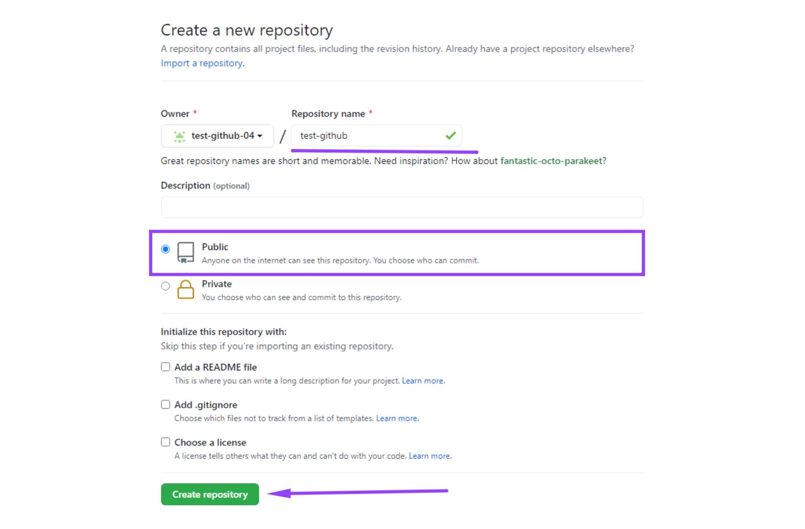
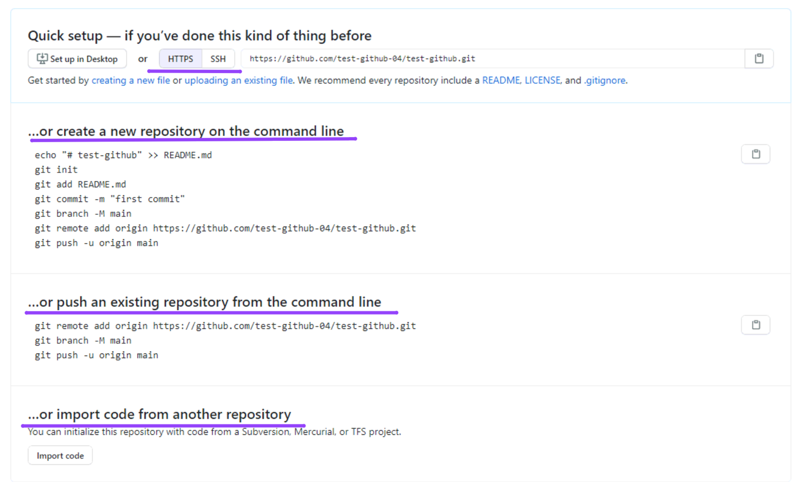

[<к содержанию](./readme.md)

# **Как опубликовать первый проект на GitHub**

Зайдите в ваш профиль: для этого кликните по иконке в правом верхнем углу и нажмите Your Profile:

Теперь создайте репозиторий: перейдите во вкладку Repositories и кликните по кнопке New:

Задайте имя репозитория. Мы придумали название проекта test-github и сделали его публичным, чтобы его могли просматривать все пользователи. Далее нажмите кнопку Create repository:

Пока проект пустой, но мы можем поместить в него наши файлы с локальной машины.

Github предлагает несколько вариантов создания проекта:

- клонировать папку по выбранному протоколу;
- создать проект с нуля;
- опубликовать уже созданный проект; 
- скопировать проект.

[<к содержанию](./readme.md)